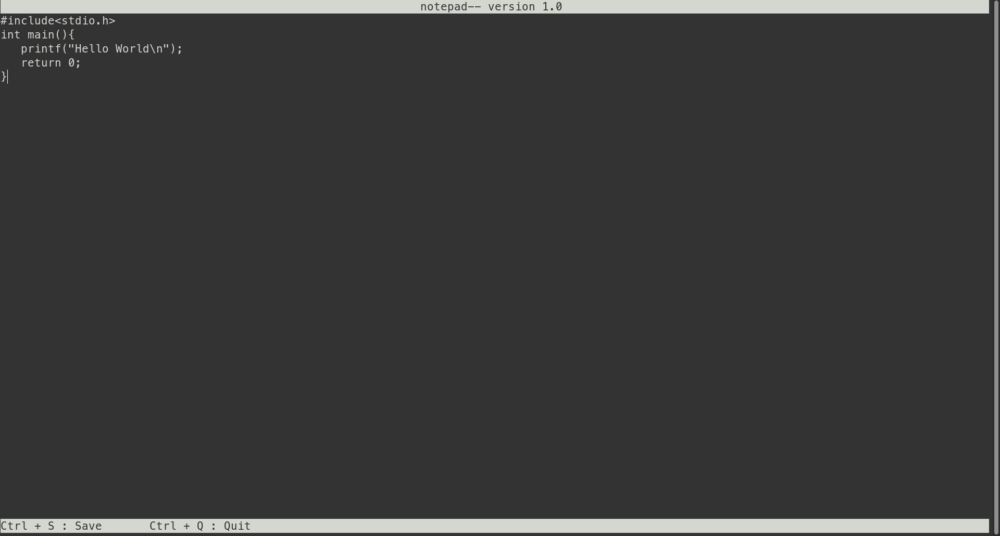

# notepad--
Command Line Text Editor

A simple and lightweight text editor for Linux and MacOS command line.

Feature addition for future release:

1) Syntax highlighting for C, C++ and Python
2) Find and Replace